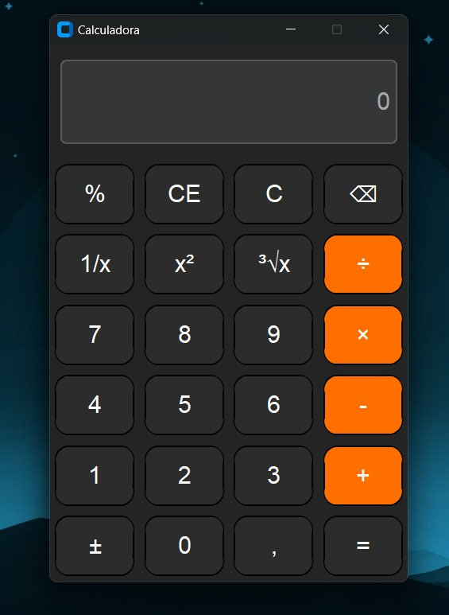

```markdown
# 🧮 Calculadora com CustomTkinter

Este é um projeto de calculadora simples desenvolvido com Python e a biblioteca `customtkinter`, que oferece uma interface moderna baseada no clássico `tkinter`.

## ✨ Funcionalidades

- Interface gráfica moderna com `CustomTkinter`
- Operações básicas: adição, subtração, multiplicação e divisão
- Botões responsivos e visual clean
- Totalmente em Python, sem dependência de compiladores

## 🛠️ Requisitos

- Python 3.7 ou superior  
- Bibliotecas:
  - `customtkinter`

## 📦 Instalação

1. **Clone este repositório:**

```bash
git clone https://github.com/samuelcalixtodev/calculadora-py.git
cd calculadora-py
```

2. **Instale a biblioteca necessária:**

```bash
pip install customtkinter
```

3. **Execute o projeto:**

```bash
python main.py
```

## 🖼️ Interface



> *Adicione uma imagem chamada `screenshot.png` do seu projeto para aparecer aqui!*

## 📁 Estrutura do Projeto

```
calculadora-py/
│
├── main.py               # Arquivo principal com a lógica da calculadora
├── README.md             # Este arquivo
└── screenshot.png        # (Opcional) Imagem da interface
```

## 🧑‍💻 Autor

- [Samuel Calixto](https://github.com/samuelcalixtodev)

## 📄 Licença

Este projeto está licenciado sob a [MIT License](LICENSE).

---
